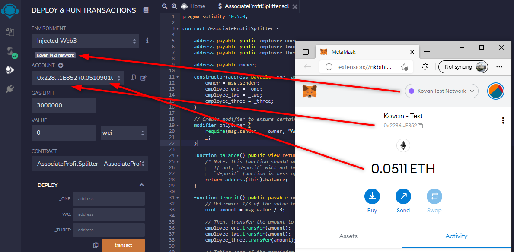
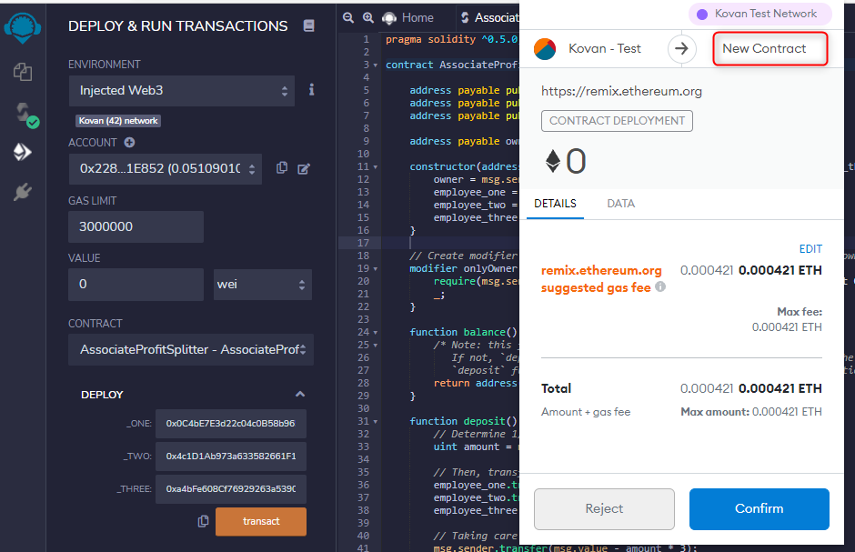
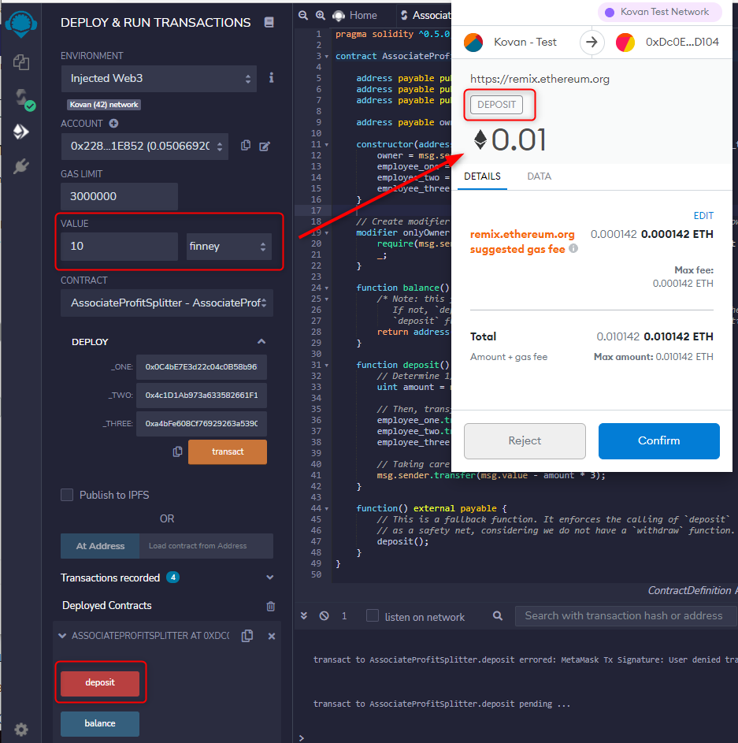
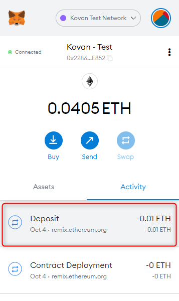
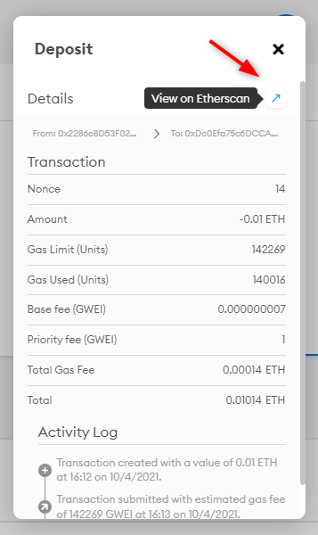
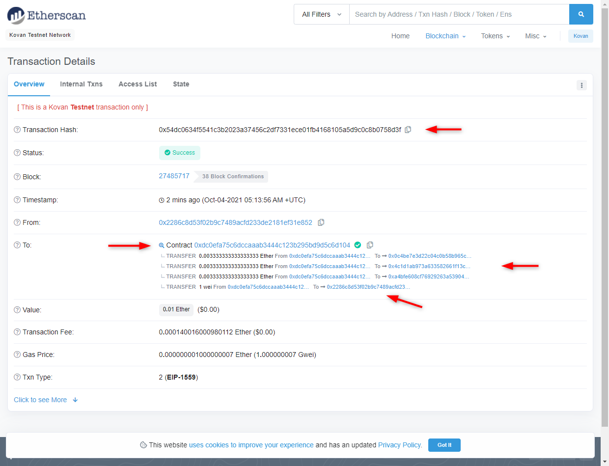
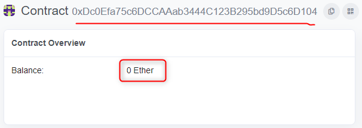
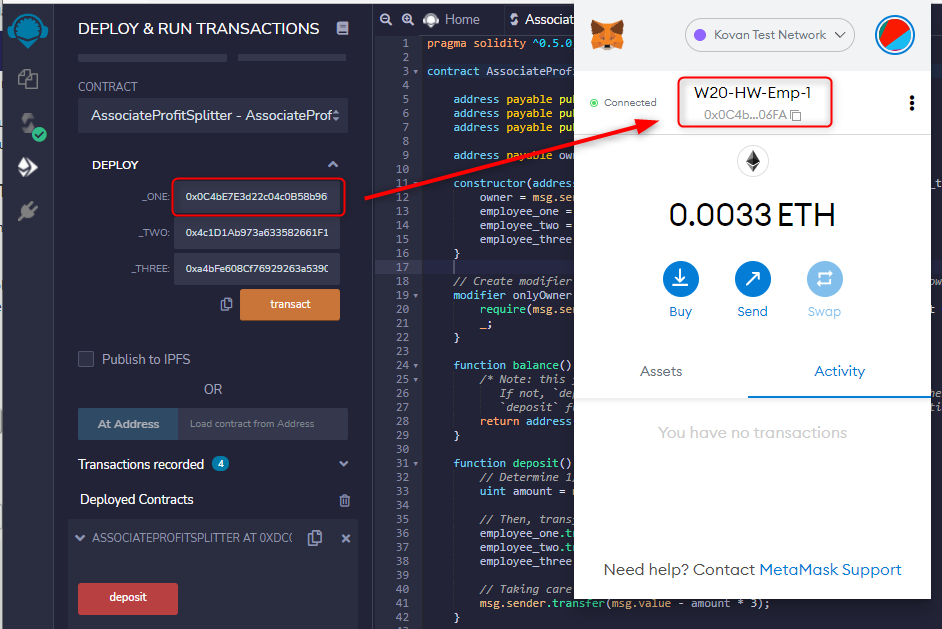
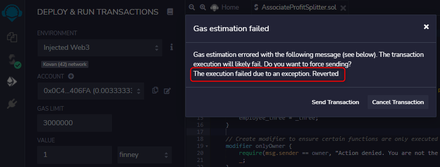
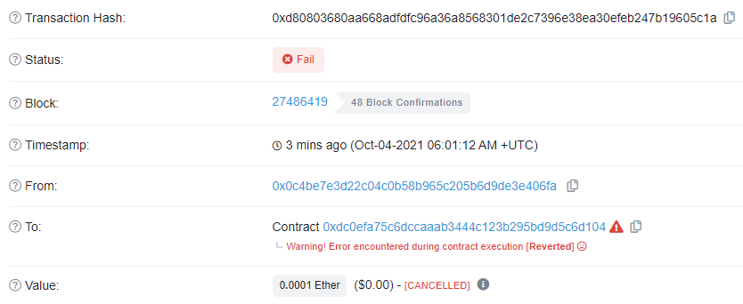

# blockchain-contracts
This project consists of an Ethereum contract or two.
The contract, once created, is tested on an Ethereum Test Network and I walk through what the contract is doing by way of some screenshots and explanatory text.

---
## Introduction

This project is all about creating a contract (or two) and interacting with it.
For the purposes of development, the contract was developed in [Remix](https://remix.ethereum.org/) (a web-based IDE (Integrated Development Environment)) and Ganache.  [Ganache](https://www.trufflesuite.com/ganache) is not an IDE, but simulates an Ethereum blockchain for development purposes.  Ganache is fantastic!!! Just saying.

## AssociateProfitSplitter - Contract 1
In this project, I create a contract, named `AssociateProfitSplitter`.  What it does is fairly simple in that,  it takes in some Ether (ETH) and then splits it up equally between 3 employees, i.e. employees one to three.  

In essence then, `AssociateProfitSplitter` distributes whatever is deposited into the contract evenly.

### Validations
There are some validations within the contract and these are implemented in a number of ways: -
- Contract constructor
  - The constructor both sets the owner of the contract, storing it in the `owner` address, as well as reads in the 3 "employee" addresses.
- The `onlyOwner` modifier
  - This modifier ensures that whenever a function is called with the modifier, the `require()` is called which ensures that the caller is the owner of the contract, i.e. no "employee" can deposit funds for distribution, only the "owner" address can.
- While not a validation, there are 2 safety-nets of sorts: -
  - the first is that any ETH (however tiny), left over after distribution (i.e. the remainder) is returned to the originating address.  In this case, the owner.
  - the second is the calling of `deposit` within `function() external payable` ensuring it is executed as a fallback mechanism, including the validation within it.

### Interaction with "Splitter"
The text and images/screenshots which follow describe and show the interaction with the contract on the "Kovan" Ethereum Test Net.  Please note the comments above each image describing the interaction detail what should be taken note of.

**Interactions**
> Preparing for the deployment of the contract onto the Kovan Test Network.  
> Note the address, the amount in ETH and the Kovan network match.  

  

> With the value = 0, the employee address populated, the contract is deployed  
> Within Metamask, the deployment is confirmed.  

  

> With the contract deployed, funds need to be deposited.  
> Note the amount is 10 finney (equivalent to .01 ETH)  
> The deposit is then confirmed.  

  

> As one can see within Metamask, the deposit is successful ...  
> Clicking on "Deposit" within Metamask opens a view of the transaction  
> Clicking on "View in Etherscan" will allow us to view the transaction on the Kovan Test Chain

    

> Viewing the transaction on Kovan's Etherscan, there are a number of things that I would like to draw your attention to, e.g. notice the following:  
>
> - The transaction hash: [0x54dc0634f5541c3b2023a37456c2df7331ece01fb4168105a5d9c0c8b0758d3f](https://kovan.etherscan.io/tx/0x54dc0634f5541c3b2023a37456c2df7331ece01fb4168105a5d9c0c8b0758d3f)  
> - The contract address: [0xdc0efa75c6dccaaab3444c123b295bd9d5c6d104](https://kovan.etherscan.io/address/0xdc0efa75c6dccaaab3444c123b295bd9d5c6d104)
> - The 3 addresses to which the deposit was distributed/transferred to
> - The "Contract Owner" address and note the remainder being transferred back to it after the deposit
> - The amount of the transaction and of course the Gas required for the transaction  

  

> Clicking on the contract itself, one can see that after the transaction, all funds were distributed and the remainder successfully transferred back to the owner.  
> The contract has no funds.  

  

**Non-happy path and error handling**
> Finally, connecting as one of the "employees" and then attempting a deposit executes the `require` within the modifier and will not allow the transaction to complete.  
>
> *Note* the message prior to the transaction.  

  

> *Note* after proceeding with the transaction (ignoring the warning) causes the transaction to revert, i.e. to not succeed.  

  

> There was a very small amount of gas which was required regardless of the outcome ... but the onus was on the employee :)  
> Let's be honest, it was their fault!  They sent it despite the warning!

  

### Conclusion
I trust that running through the contract and seeing what it does, how it is viewed on the blockchain, the interactions with Metamask, has been useful and enlightening. 

# Acknowledgements and References
- Remix has been used as the IDE for this little project.
- Ganache has also been used to help with the testing off-chain.
- I made use of the Chainlink Faucet for the ETH I used in this project, find that [here](https://faucets.chain.link/kovan)
- Ethereum Foundation needs to be acknowledged for their work, creating their blockchain, which allows for the deplyment and interaction with "smart-contracts".
- Thanks to Trinity College, an organisation that has provided the training which has allowed for the accomplishment of this demo (as part of a Monash University Bootcamp).

